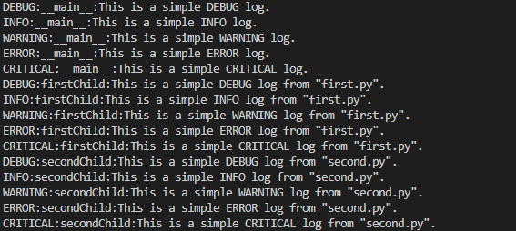
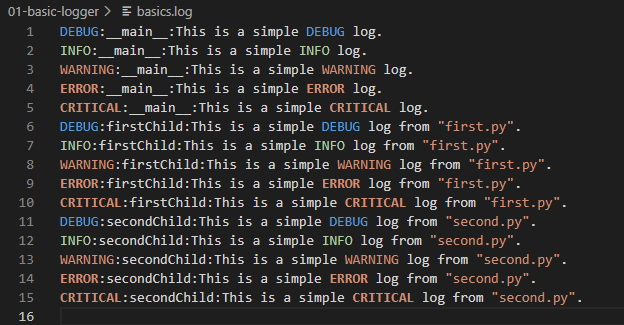
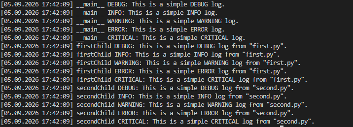
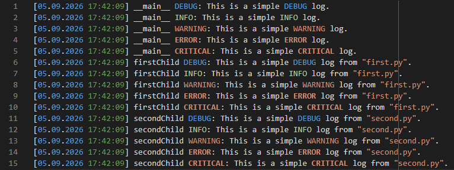

# 📖 **Loggers for Python**
 

## 🌐 **Project Overview**

This repository demonstrates various configurations of a Python logger for the purpose of self-study. There is no general introduction to loggers contained. If you are interested in understanding the concept of loggers in particular how you do it in Pyhton you may visit the official Python documentation for the logging module:

https://docs.python.org/3/library/logging.html

## 🗂️ Structure

There are eleven folders each containing one configuration for a Python logger. Each folder has the following structure:

```text
xx-logger-example/
├── main.py
├── firstChild.py
└── secondChild.py
```

The logger configurations are set in the `main.py` file. In addition there is a function defined named `log_messages` to demonstrate log messages for all logging levels. The other two files have functions `first_logs` and `second_logs` which also create log messages for all logging levels but both functions are called from `main.py`.

Choose an example, switch to the corresponding folder and then run the file `main.py` to see the output of the logs.

## 🚀 Getting started

Clone the repository by using the following command:

```bash
git clone https://github.com/HamsterHugo/python-logging.git
```

Change directory to the project folder:

```bash
cd python-logging
```

I recommend to create a virtual environment. If you are using VS Code you can do so by running the following command:

```bash
python -m venv .venv
```

You can activate the virtual environment with the following command:

```bash
.venv\Scripts\activate
```

Finally, you have to install the requirements. You can do so by executing the following code:

```bash
pip install -r requirements.txt
```

ℹ️ **Notice:** You have to install the packages only once.

Now, you are able to start. For that, select an example and change to the corresponding folder, for instance:

```bash
cd 01-basic-logger
```

Then, just run the command:

```bash
python main.py
```

You can see the output of the logger in the terminal and in the corresponding log file which is created after running `main.py`.

## 📌 **The examples**

### 01 Basic Configurations

This configuration demonstrates the default setting in the logging module. The logger has a Stream- and a Filehandler.

 

### 02 Custom Logger

A custom format for the logs message and the datetime is used. Again, the logger has a Stream- and a Filehandler.

 